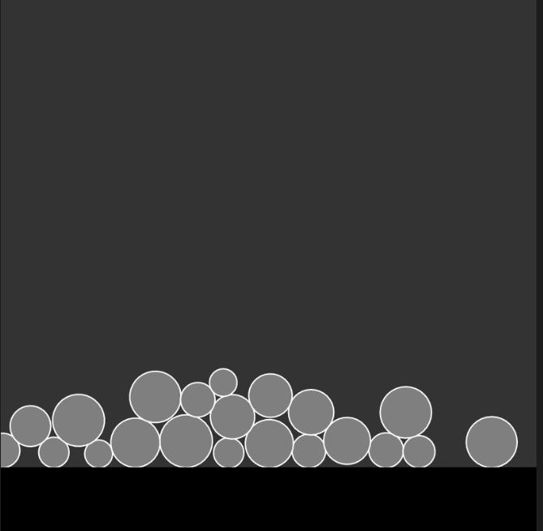
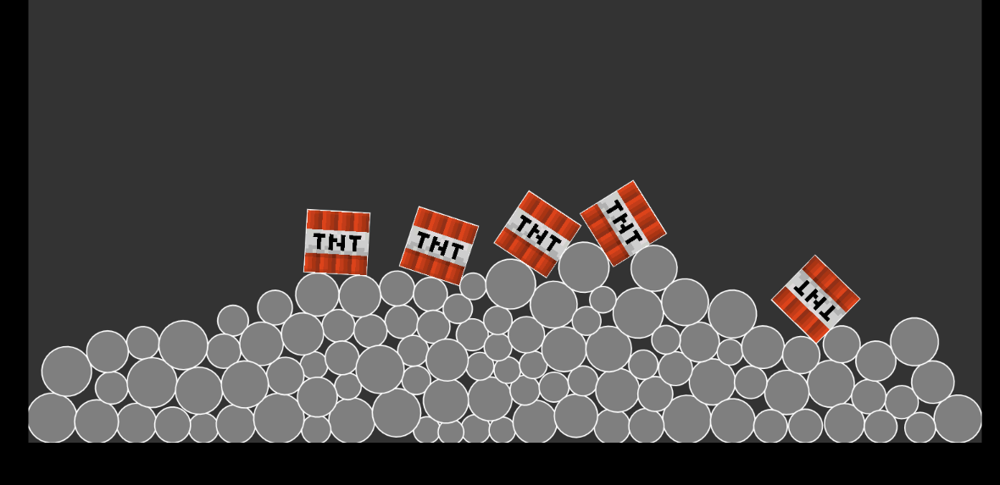

# experiment 3 - Use of a physics engine (such as matter.js) to create an interactive simulation of real world (or unreal/subverted) behaviour, or a game mechanic based on physics. #

[run simulation](ex3_TNT/index.html)

## Overview ##

I tweaked work made by the coding train, which originally made rectangle objects generate when the mouse gets clicked. I changes the objects into spheres, added walls, and created a new class, for TNT. When the user clicks, it drops a minecraft TNT block, which explodes after 5 seconds, sending nearby spheres flying.

## first version ##
  

This image shows the first iteration on the original code, where i had changed the rectangles for circles.

This image shows the final version.  
The changes i made are:
- made new wall objects using the code for making the boundary class (originally for the floor).
- made it so that 100 balls generate when the program is first executed, just by changing the mouseClicked function into a simple for loop.
-added a new class for TNT, which uses framecount to calculate the a timer, explodes when the timer is complete, sending the spheres flying after calculating a displacement vector, effecting closer balls more than further away balls.

## Critical reflection ## 

This was my first time coding using a physics engine. Similarly to 3d modelling, it really spoke to the part of me that wants to make games, i even thought about using the physics engine in a 3d environment, but unfortunately matter.js is uncompatible with WEBGL.

I found a lot of the code very difficult to wrap my head around, but after a lot of time googling, i managed to patch together something that worked. I didn't leave myself enough time to check through all of my code properly, so i doubt its perfect, but the final result works as i hoped, so that's definitely an accomplishment there. 

While i'm not sure where i will use my knowledge in creative coding, i'm eager to spend more time with javascript now, as it's now my strongest coding language by quite a large margin.

### references ### 

the coding train 7/3/2017 https://www.youtube.com/watch?v=urR596FsU68
minecraft https://minecraft.wiki/w/TNT
