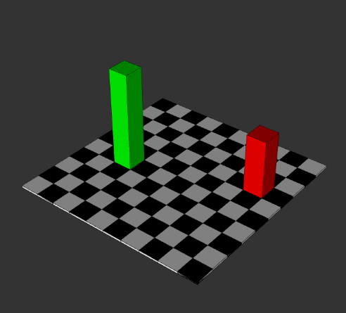
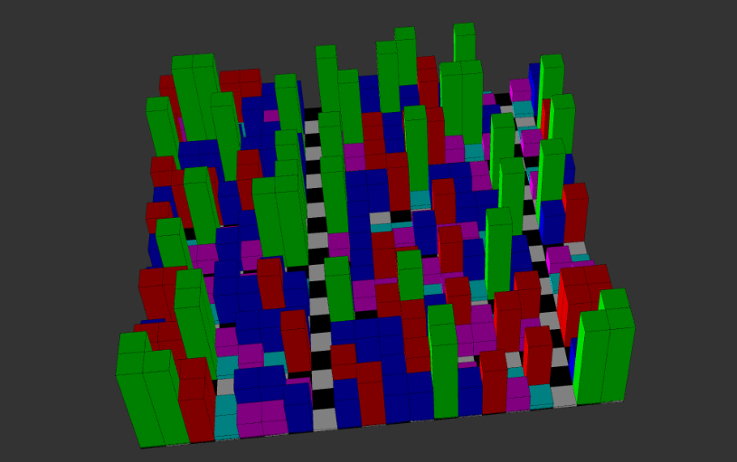

## experiment 2 - A city or landscape generator, with at least 3 distinct types of building, land or other object. It should be unique each time you run it. ## 

[see the city](ex2_city/index.html)

# Overview #

For the second exercise, i decided to tackle 3d geometry for the first time, a city with an assortment of buildings.

# figuring out 3d # 

Using WEBGL in p5.js, i was able to quickly grasp the basics of 3d geometry. Using functions such as beginGeometry() to make basic cuboids, and a checker board for the buildings to sit on. It started off quite similarly to cookie clicker, with lots of uncessary variables.

# discovering classes #

With my original strategy, i ran into the problem of not being able to reuse the same geometry multiple times. This would have lead to me copying the same code many times to fill the whole city. I instead found a different way; classes. By making a seperate class for each object, i was able to make multiple of the same building easily. 

I used a 2d array to represent each of the squares on the checker board, and worked through each location on the array using a for loop to fill the city with random buildings. I then added conditions to make gaps between the buildings, seperating them into blocks, making a city environment.

# critical reflection # 

This is absolutely one of my favourite things i've made this year. I found it really exciting to start figuring out 3d geometries because i can see that this course is going in the direction i want it to. I will absolutely revisit this code in the future in order to make my first 3d platformer.

It also vastly improved my knowledge of object orientated programming, and i can now confidently say i understand classes.

If i had more time, i would have imported 3d models for each of the buildings, making it look like an actual city.

